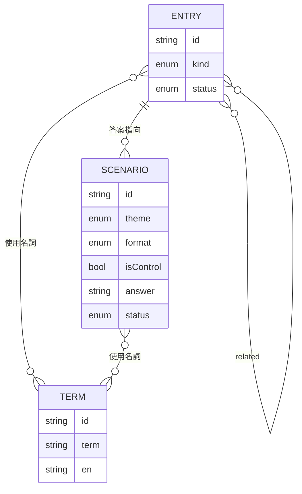

# 02 領域模型

用語定義見 `CONTEXT.md`。

## 規則
1. 情境題依 `format` 分為四種題型（ADR-0022）：`judge`（預設，單選判讀）、`multi`（多重判讀）、`validity-soundness`（有效 × 健全）、`choice`（隱藏前提／形式辨識／反例選擇）。`judge` 以外的題型只出現在進階模式。
2. `judge` 題的 `answer` 為某圖鑑卡 `id`，或 `none`（對照題必為 `none`，且只有 `judge` 題可以是對照題）；選項由 `distractors`（2–3 個圖鑑卡 id）＋正解＋「沒有問題」組成，順序於前端打亂。`multi` 題的選項為 `answers`、`acceptable`、`distractors` 的圖鑑卡，不提供「沒有問題」。
3. 發布時只取 `status: reviewed`；若 reviewed 情境題引用了非 reviewed 的圖鑑卡，建置失敗。
4. 圖鑑卡「收集」條件：答對任一 `answer` 為該卡的情境題，或完全答對 `answers` 含該卡的 `multi` 題（`acceptable` 不算）；基礎概念、思維定律與有效推論卡必有卡內小檢核，可透過「閱讀完並完成小檢核」收集。其他卡別若尚無對應情境題，也應附小檢核，避免「圖鑑收藏家」無法達成。
5. 認知偏誤卡在介面上一律加註：「這是心理上的推理陷阱，不是邏輯形式錯誤」，並顯示證據強度標籤（ADR-0021）。

## 卡別與 MVP 清單
| 卡別 | MVP 卡片 |
|---|---|
| concept 基礎概念 | 命題與真值、有效與健全、演繹／歸納／溯因、必要條件與充分條件、條件句的四種變形、什麼是「真」？（ADR-0020）、非暴力溝通、主觀意義、客觀意義 |
| law 思維定律與哲學原則 | 同一律、不矛盾律、排中律、充足理由律（有爭議的哲學原則，非形式定理） |
| inference 有效推論 | 肯定前件、否定後件、假言三段論、選言三段論 |
| formal-fallacy 形式謬誤 | 肯定後件、否定前件（與有效推論成對顯示） |
| informal-fallacy 非形式謬誤 | 稻草人、人身攻擊、不當訴諸權威、滑坡、假兩難、草率概括、訴諸自然、相關誤為因果、謬誤謬誤、訴諸無知（ADR-0020）、訴諸傳統、訴諸武力（draft） |
| bias 認知偏誤 | 確認偏誤、倖存者偏誤、可得性捷思 |

共 34 張：訴諸武力為 draft，待人工審核；其餘已審。知識範圍與後續路線見 `12-knowledge-scope.md`。
