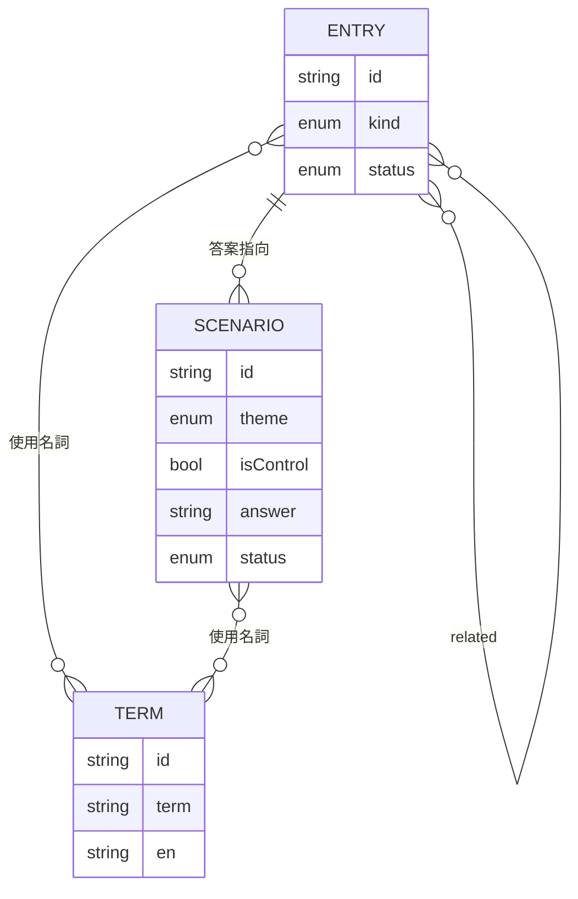

# 02 領域模型

用語定義見 `CONTEXT.md`。

## 規則
1. 情境題的 `answer` 為某圖鑑卡 `id`，或 `none`（對照題必為 `none`）。
2. 每題選項由 `distractors`（2–3 個圖鑑卡 id）＋正解＋「沒有問題」組成，順序於前端打亂。
3. 發布時只取 `status: reviewed`；若 reviewed 情境題引用了非 reviewed 的圖鑑卡，建置失敗。
4. 圖鑑卡「收集」條件：答對任一 `answer` 為該卡的情境題；思維定律與有效推論卡另可透過「閱讀完並完成卡內小檢核」收集。
5. 認知偏誤卡在介面上一律加註：「這是心理上的推理陷阱，不是邏輯形式錯誤」。

## 卡別與 MVP 清單
| 卡別 | MVP 卡片 |
|---|---|
| law 思維定律 | 同一律、不矛盾律、排中律、充足理由律 |
| inference 有效推論 | 肯定前件、否定後件、假言三段論、選言三段論 |
| formal-fallacy 形式謬誤 | 肯定後件、否定前件（與有效推論成對顯示） |
| informal-fallacy 非形式謬誤 | 稻草人、人身攻擊、不當訴諸權威、滑坡、假兩難、草率概括、訴諸自然、相關誤為因果、謬誤謬誤 |
| bias 認知偏誤 | 確認偏誤、倖存者偏誤、可得性捷思 |

共 22 張。
